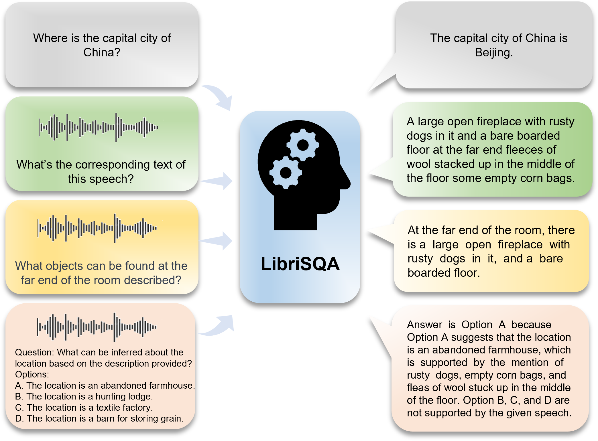
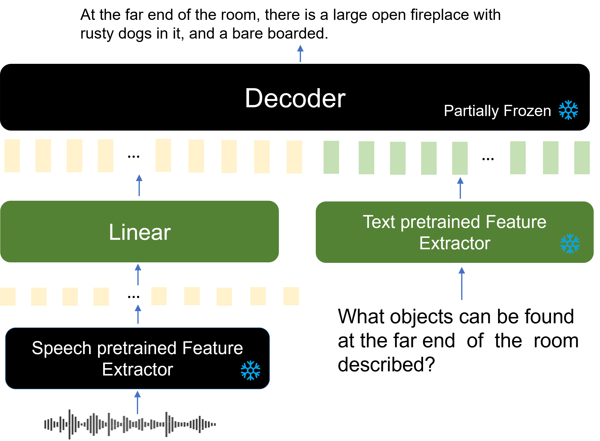
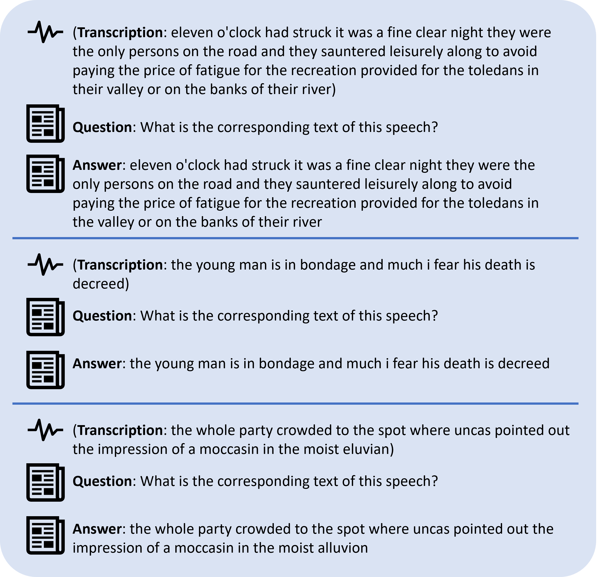
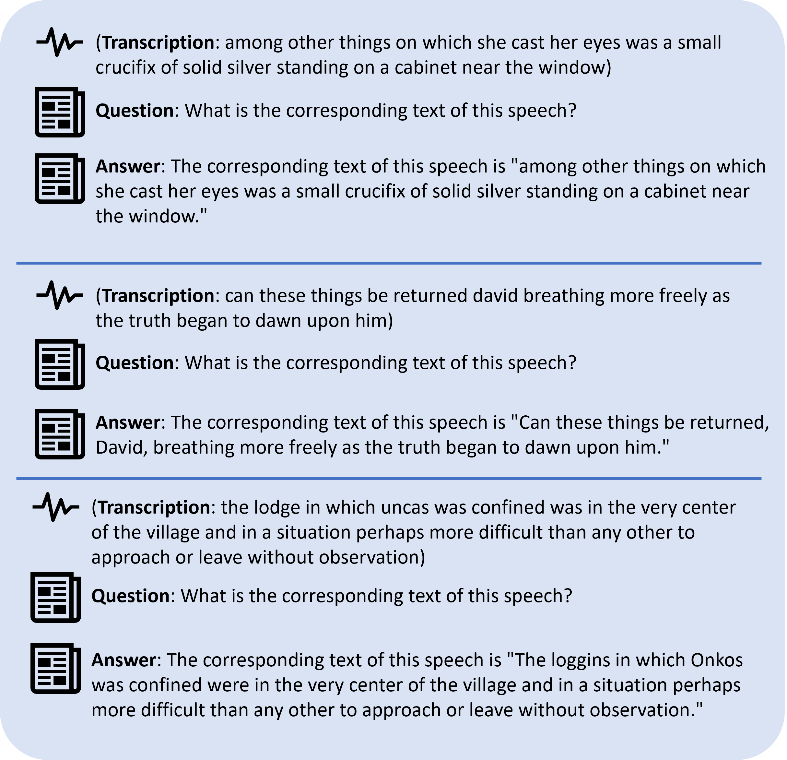
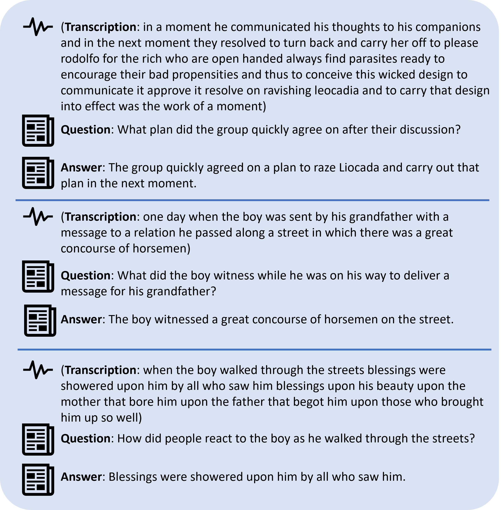
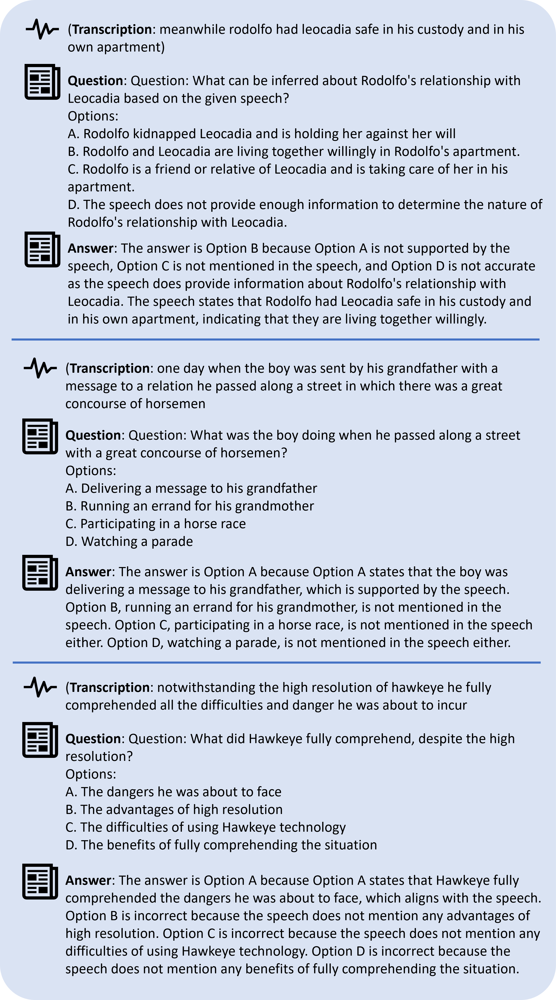

# LibriSQA: Advancing Free-form and Open-ended Spoken Question Answering with a Novel Dataset and Framework
<a href='https://huggingface.co/datasets/ZihanZhao/LibriSQA'></a> <a href='https://arxiv.org/pdf/2308.10390.pdf'></a>

<p align="center">
     <br>
</p>

- [LibriSQA](#librisqa-advancing-free-form-and-open-ended-spoken-question-answering-with-a-novel-dataset-and-framework)
  - [Introduction](#introduction)
  - [Usage](#usage)
    - [1. Download the speech from LibriSpeech](#1-download-the-speech-from-librispeech)
    - [2. Download LibriSQA](#2-download-librisqa)
  - [Model](#model)
  - [Demo](#demo)
    - [1. Automatic speech recognition (ASR)](#1-automatic-speech-recognition-asr)
    - [2. Automatic speech recognition (ASR) without LibriSpeech](#2-automatic-speech-recognition-asr-without-librispeech)
    - [3. LibriSQA Part I](#3-librisqa-part-i)
    - [4. LibriSQA Part II](#4-librisqa-part-ii)
  - [Acknowledgement](#acknowledgement)
  - [Contribution](#contribution)
  - [Citation](#citation)

## Introduction

**LibriSQA**, built on LibriSpeech [1], offers the first **free-form** and **open-ended** spoken question answering (SQA) dataset tailored for large language models (LLMs) to undergo **end-to-end SQA** training, featuring genuine speech and lengths suitable for LLMs. It has two parts: Part I with **natural dialogues** and Part II in a **multiple-choice** format, complete with correct answers and analysis. Using **LibriSQA**, we've successfully introduced a **speech-text multimodal training framework** capable of handling tasks like **common sense question answering**, **automatic speech recognition** (ASR), as well as **natural dialogue SQA** and **multiple-choice SQA**, showcasing that with **LibriSQA**, models can be trained to excel in speech-text alignment, efficiently leveraging multimodal data.

We have released the dataset and we will release the code soon.

<div align="center">
    
</div>

## Usage
### 1. Download the speech from LibriSpeech
Training: https://www.openslr.org/resources/12/train-clean-360.tar.gz

testing: https://www.openslr.org/resources/12/test-clean.tar.gz
### 2. Download LibriSQA
The dataset is available at [Huggingface](https://huggingface.co/datasets/ZihanZhao/LibriSQA)

## Model
<div align="center">
    
</div>

## Demo
### 1. Automatic speech recognition (ASR)
Trained with LibriSpeech [1] with SQA format.

<div align="center">
    
</div>

### 2. Automatic speech recognition (ASR) without LibriSpeech
Trained with our LibriSQA **without** any speech-text pair.

<div align="center">
    
</div>

### 3. LibriSQA Part I
Trained with LibriSQA Part I.

<div align="center">
    
</div>

### 4. LibriSQA Part II
Trained with LibriSQA Part II.

<div align="center">
    
</div>

## Acknowledgement
[1] LibriSpeech: An ASR corpus based on public domain audio books: -- https://ieeexplore.ieee.org/abstract/document/7178964

[2] LLaMA: Open and Efficient Foundation Language Models -- https://arxiv.org/abs/2302.13971

[3] LLaMA-Adapter: Efficient Fine-tuning of Language Models with Zero-init Attention -- https://arxiv.org/abs/2303.16199

[4] PMC-VQA: Visual Instruction Tuning for Medical Visual Question Answering -- https://arxiv.org/abs/2305.10415

We thank the authors for their great idea and open-sourced code which helped us with this paper.

## Contribution

Please raise an issue if you need help, any contributions are welcomed.

## Citation

If you use LibriSQA for your research, please cite our [paper](https://arxiv.org/pdf/2308.10390.pdf)

```
@article{zhao2023librisqa,
         title={LibriSQA: Pioneering Free-form and Open-ended Spoken Question Answering with a Novel Dataset and Framework},
         author={Zhao, Zihan and Jiang, Yiyang and Liu, Heyang and Wang, Yanfeng and Wang, Yu},
         journal={arXiv preprint arXiv:2308.10390},
         year={2023}
}
```
